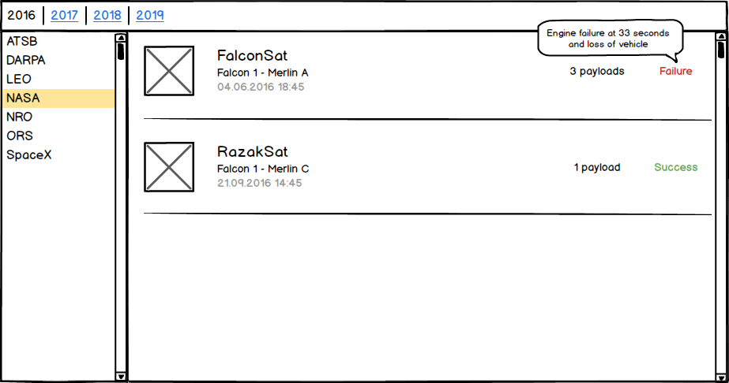

# JS & Rockets: Part 2

**Congratulations, you made it to part 2!** In this step, you will use the experience you obtained in the previous exercise to build a small application that can be used to visualize the SpaceX missions.

## Spec: Features

In this document you will find a mockup, and some specs to follow. The project was already created using the Creat React App Toolchain with the structure you'll need to implement your solution.

**Please take your time to read everything** and to make sure you understand the requirements entirely before you start writing code and feel free to ask us any questions.

### The mockup

### The data

All shown data should be fetched from the SpaceX API (the same you used in the previous task): **https://api.spacexdata.com/v3/launches/past**

### The years bar

- The years bar is a clickable list of the last 5 years
- Years appears chronologically and only once
- Clicking a year makes it the selected year (active)
- The oldest year should be the default selection

### The sidebar

- The sidebar is a clickable list of all available customers for the **selected year**
- Customers appear alphabetically and only once
- Clicking a customer makes it selected (active)
- The first customer should be the default selection

### The missions' list

- The Content Pane is a list of all available missions for the **selected year** and **selected customer**

## Available Scripts

In the project directory, you can run:

### `yarn start` or `npm start`

Runs the app in the development mode. 
Open [http://localhost:3000](http://localhost:3000) to view it in the browser.

The page will reload if you make edits. 
You will also see any lint errors in the console.
